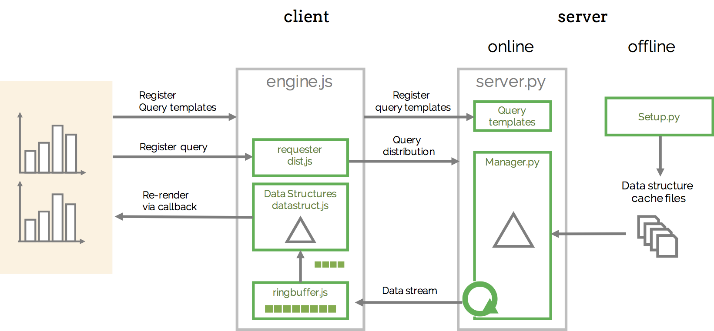

# Setup

## Install and setup

Install nodejs, npm, protocol buffer, postgres.  OSx instructions:

        brew install node npm protobuf postgresql

Install python packages (probably want to use virtualenv)

        pip install flask numpy scipy bsddb3 psycopg2 sqlalchemy

Install node modules:

        npm install .

Install global node module:

        npm install -g browserify

Setup a postgres database

        createdb test

## Compiling and Running

Compile protocol buffers, package javascript files in `js/` into a single deployable file:

        make

Setup offline data structures
    
        python setup.py 

Launch server

        python server.py

Go to webpage: `http://localhost:5000`

# Architecture Overview

This figure represents the overall architecture of the system and will be used to introduce the major files.  
From left to write, the developer creates visualization charts as wrappers around query templates.
When the viz are instantiated, the [query templates](./js/query.js) are registered with the [server](./py/server.py),
so the [server](./py/server.py) can instantiate the appropriate [precomputed data structures](./py/ds.py).
The query templates basically parameterize SQL queries.

When a user interacts with the viz (in this case, by hovering over bars), it generates parameter
values for the visualization's corresponding query template.  The combination is called a query, 
which is registered with the client [Engine](./js/engine.js).  If the data to answer the query
is already in the client's cache, then the appropriate [client data structure](./js/datastruct.js) 
will compute the result and trigger a call back to update the appropriate visualizations.

If data is not available, then the [requester](./js/dist.js) will turn the request into a 
query distribution (where the query has probability 1, and everything else has probability 0)
and sends the distribution to the [server](./py/server.py).  The requester's other job is to continuously predict the future query distribution and 
send it to the server.  The impulse distribution is only used when the user actually runs
a query that is not in the cache.

The server's [manager](./py/manager.py) is basically an infinite loop that can continuously
send data to the client.  The instantiated data structures read from pre-computed cache files 
to answer queries in the current query distribution and sends a byte stream to the client.

The client recieves and caches the byte stream into a simple [ring buffer](./js/ringbuffer.js).
Everytime it detects a usable block of bytes, it sends it to the appropriate [data structure](./js/datastruct.js) 
to decode and use to answer client queries.

You can run [setup.py](./py/setup.py) beforehand to pre-compute files for the data structures.

## Data Structures

Data structures represent different typs of storage engines that could answer user queries.
Data structure objects are represented as triangles in the architecture, they read cached files
generated ahead of time (offline).  They are the workhorse for answering queries.

There are a few key concepts that are important to understand how they work. 

* Data structures are instantiated with a query template (e.g., `SELECT * WHERE a = ? AND b = ? ...`)
  and precomputes all possible assignments to those parameters.
* For a given data structure, it's "query input" is the ID of the query template and the values for the parameters.
* Data structures send a block of byte-encoded data to the client, which needs to decode the bytes.
* On the client, once the bytes are (optionally) decoded into javascript objects, the data structure
  still needs to know which queries the data can answer.  To do so, we basically hash
  the parameter values and use it as a lookup key.
* All of this means that we need to carefully ensure that data and queries are represented
  in exactly the same way in the client, the web server, and the offline scripts.

## Assignments

Assignment 1:

Get it running
Add a fourth visualization

ASsignment 2:

